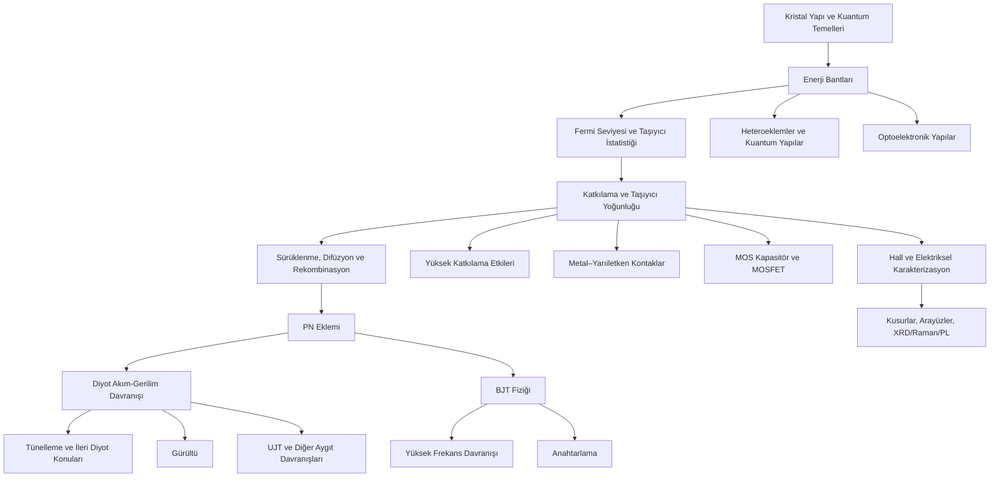

# Yarıiletken Fiziği — İnteraktif Ders Çalışma Yardımcısı

Bu çalışma, yarıiletken fiziğini yalnızca formülleri ezberleyerek değil; **fiziksel sezgi, bant diyagramları, taşıyıcı istatistiği, interaktif grafikler ve problem çözme** üzerinden öğrenmeye yardımcı olmak için hazırlanmış **14 haftalık çekirdek ders + 6 modern yarıiletken yapılar modülünden** oluşan bir ders çalışma dokümanıdır.

> **Amaç:** Bir denklemi kullanabilmenin yanında, o denklemin ne anlattığını, hangi büyüklüklerin sonucu nasıl değiştirdiğini ve farklı yarıiletken aygıtlarının aynı temel fizik üzerinden nasıl birbirine bağlandığını görebilmek.

## Nasıl çalışılmalı?

Her konuyu mümkünse şu sırayla çalışın:

1. **Önce fiziksel fikri okuyun.** Formüle geçmeden önce olayın ne olduğunu kendi cümlelerinizle açıklamaya çalışın.
2. **Denklemi inceleyin.** Her sembolün fiziksel anlamını ve birimini kontrol edin.
3. **Grafiğe bakmadan tahmin yapın.** Bir parametre artarsa eğrinin veya bant diyagramının nasıl değişeceğini düşünün.
4. **İnteraktif kontrollerle deneyin.** Tahmininizle simülasyon sonucunu karşılaştırın.
5. **Kavramsal soruları çözün.** Sonucu değil, nedenini açıklayabiliyor olmayı hedefleyin.
6. **Hafta sonunda geri çağırın.** Notlara bakmadan ana kavramları ve temel denklemleri yazmayı deneyin.

## Kavram Haritası



Bu haritanın önemli mesajı şudur: konular birbirinden bağımsız değildir. Özellikle **enerji bantları → Fermi seviyesi → taşıyıcı yoğunluğu → PN eklemi → diyot/BJT** zinciri dersin omurgasını oluşturur.

## Çekirdek 14 Haftalık Çalışma Rotası

| Aşama | Odak | Çalışırken kendine sor |
|---|---|---|
| 1 | Kristal ve yarıiletken temelleri | Bir katıyı iletken, yalıtkan veya yarıiletken yapan nedir? |
| 2 | Bant teorisi | Yasak enerji aralığı fiziksel olarak neyi ifade eder? |
| 3 | Taşıyıcı istatistiği | Fermi seviyesi elektron ve delik yoğunluğunu nasıl belirler? |
| 4 | Katkılama ve taşınım | Katkılama, hareketlilik ve iletkenlik arasında nasıl bir ilişki vardır? |
| 5 | PN eklemi | Tükenim bölgesi neden kendiliğinden oluşur? |
| 6 | Diyot | İleri ve ters kutuplamada bantlar ve akım nasıl değişir? |
| 7 | İleri diyot konuları | İdeal model hangi durumlarda yetersiz kalır? |
| 8 | Gürültü | Termal, shot ve 1/f gürültülerinin fiziksel kökenleri nasıl ayrılır? |
| 9 | BJT temelleri | Küçük bir baz akımı büyük kolektör akımını neden kontrol edebilir? |
| 10 | BJT fiziksel modeli | Enjeksiyon, rekombinasyon ve taşıma kazancı nasıl belirler? |
| 11 | Yüksek frekans | Frekans arttığında ideal transistor modeli neden bozulur? |
| 12 | Anahtarlama | Depolanan yük anahtarlama süresini nasıl etkiler? |
| 13 | İleri/özel aygıt davranışları | Klasik yaklaşımın dışına çıkıldığında hangi fizik önem kazanır? |
| 14 | UJT ve genel tekrar | Farklı aygıtları ortak yarıiletken fiziği üzerinden açıklayabilir miyim? |

> Haftaların başlıkları uygulamadaki ayrıntılı içerikle birlikte kullanılmalıdır. Bu tablo bir **çalışma rotasıdır**, ders içeriğinin yerine geçmez.

## Modern Yarıiletken Yapılar Modülleri

Çekirdek 14 haftalık içerik korunmuştur. Bunun yanına, yüksek lisans düzeyinde yarıiletken **yapılar** fiziğini tamamlamak için aşağıdaki altı modül eklenmiştir:

| Modül | Konu | Ana bağlantı |
|---|---|---|
| 15 | Metal–yarıiletken kontaklar | İş fonksiyonu, elektron ilgisi, Schottky bariyeri, termiyonik emisyon, ohmik kontak |
| 16 | MOS kapasitör ve MOSFET fiziği | Accumulation, depletion, inversion, flat-band, C–V, threshold, kanal oluşumu |
| 17 | Heteroeklemler ve kuantum yapıları | Band offset, Type-I/II/III, quantum well, boyuta bağlı DOS, HBT/HEMT |
| 18 | Optoelektronik yarıiletken yapılar | Soğurma, direkt/dolaylı gap, fotodiyot, güneş hücresi, LED/lazer |
| 19 | Hall etkisi ve elektriksel karakterizasyon | Taşıyıcı tipi/yoğunluğu, mobilite, four-point probe, I–V ve C–V |
| 20 | Kusurlar, arayüzler ve malzeme karakterizasyonu | SRH tuzakları, yüzey durumları, XRD, Raman, PL, UV–Vis |

Ayrıca 1. haftada **Bloch teoremi, Brillouin bölgesi ve Kronig–Penney modeli** ile “kristal yapıdan enerji bantlarına nasıl geçiyoruz?” sorusu daha açık biçimde bağlanmıştır.

Bu genişletilmiş rota özellikle şu zinciri görünür kılmayı amaçlar:

```text
Kristal → periyodik potansiyel → E(k) → DOS/Fermi
        → taşıyıcılar ve transport
        → PN / Metal-SC / MOS / heteroeklem
        → optik, kuantum ve gerçek arayüz etkileri
        → deneysel karakterizasyon
```


## Her Hafta İçin Öğrenme Hedefi

Bir haftayı tamamlamış sayılmadan önce aşağıdaki dört seviyeyi kontrol edin:

- **Tanımla:** Temel kavramları ve sembolleri açıklayabiliyorum.
- **Tahmin et:** Bir parametre değiştiğinde sonucun hangi yönde değişeceğini grafiğe bakmadan söyleyebiliyorum.
- **Hesapla:** Temel denklemleri doğru birimlerle kullanabiliyorum.
- **Açıkla:** Çıkan sonucun fiziksel nedenini kendi cümlelerimle anlatabiliyorum.

Sadece hesap yapabiliyor olmak konunun tam öğrenildiği anlamına gelmez. Özellikle interaktif grafiklerde önce **tahmin**, sonra **deney**, ardından **açıklama** sırasını kullanın.

## Mini Deney Yöntemi

Bir slider veya parametreyi değiştirmeden önce küçük bir hipotez kurun:

> **Tahmin → Değiştir → Gözlemle → Açıkla**

Örnek:

**Soru:** PN ekleminde katkılama yoğunluğu artarsa tükenim bölgesinin genişliği ne olur?

Önce cevabınızı düşünün. Ardından parametreyi değiştirip grafiği gözlemleyin. Son olarak sonucu yalnızca “azaldı/arttı” diye değil, yük dengesi ve elektrik alan açısından açıklamaya çalışın.

Aynı yöntemi Fermi seviyesi, taşıyıcı yoğunluğu, diyot akımı, BJT kazancı, gürültü ve yüksek frekans davranışında da kullanabilirsiniz.

## Sık Yapılan Hatalar

### Formülü fiziksel modelden koparmak
Bir denklemi ezberlemek yerine hangi varsayımlar altında kullanıldığını düşünün. İnteraktif grafikler özellikle bu sezgiyi geliştirmek için kullanılmalıdır.

### Elektron ve delik işaretlerini karıştırmak
Elektronun yükünün negatif olması ile elektron yoğunluğunun pozitif bir sayı olması farklı kavramlardır.

### Fermi seviyesini “elektronların bulunduğu enerji” olarak düşünmek
Fermi seviyesi tek tek elektronların enerjisini göstermez; taşıyıcıların enerji durumlarını doldurma olasılığını belirleyen istatistiksel bir büyüklüktür.

### Enerji bantlarını gerçek uzaysal katmanlar gibi düşünmek
Bant diyagramları enerji ilişkilerini gösterir. Özellikle konuma bağlı bant diyagramlarında yatay eksenin neyi temsil ettiğini kontrol edin.

### Birimleri karıştırmak
Yarıiletken fiziğinde özellikle `cm⁻³` / `m⁻³`, `cm²/(V·s)` / `m²/(V·s)`, eV / J dönüşümlerine dikkat edin.

### Denge ile kutuplama durumunu karıştırmak
Termal dengede tek bir Fermi seviyesi kavramı kullanılır. Kutuplama ve denge dışı durumlarda yorum değişebilir.

### Grafiği yalnızca şekil olarak okumak
Eksenleri, ölçeğin lineer/logaritmik oluşunu ve değiştirilen parametreyi kontrol etmeden grafik hakkında sonuç çıkarmayın.

## Grafik Okuma Kontrolü

Bir grafiği incelerken şu dört soruya cevap verin:

1. **Eksenler neyi gösteriyor ve birimleri ne?**
2. **Hangi parametre sabit, hangisi değişiyor?**
3. **Limit durumlarında ne bekliyorum?**
4. **Grafikteki şekli hangi fiziksel mekanizma oluşturuyor?**

Özellikle logaritmik grafiklerde görsel eğimin lineer grafiklerle aynı şekilde yorumlanamayacağını unutmayın.

## Formül Çalışma Kartı

Yeni bir denklem gördüğünüzde aşağıdaki küçük kartı zihninizde doldurun:

| Soru | Kontrol |
|---|---|
| Ne hesaplıyor? | Çıktının fiziksel anlamı |
| Neye bağlı? | Bağımsız değişkenler |
| Birimi ne? | Boyut kontrolü |
| Hangi yönde değişir? | Fiziksel sezgi |
| Hangi koşullarda geçerli? | Modelin varsayımları |
| Grafikte nasıl görünür? | Denklem ↔ görsel bağlantısı |

## Kendini Test Et

Bir konuyu tamamladıktan sonra notlara bakmadan:

- Konuyu 60 saniyede sözlü olarak açıklayın.
- En önemli 3 kavramı yazın.
- Bir temel denklemi yazıp sembollerini açıklayın.
- Bir parametreyi 10 kat artırdığınızda ne olacağını tahmin edin.
- İlgili grafiği kabaca çizin.
- Konuyu bir önceki ve bir sonraki haftayla ilişkilendirin.

Bunlardan birini yapamıyorsanız doğrudan formülü tekrar ezberlemek yerine ilgili görsel veya simülasyona geri dönmek genellikle daha yararlıdır.

## İçeriğin Kapsamı

Dokümanda yarıiletken fiziğinin temel kavramlarından başlayarak enerji bantları, taşıyıcı istatistiği, katkılama, PN eklemi, diyotlar, tünelleme, yüksek katkılama etkileri, gürültü, BJT fiziği, yüksek frekans davranışı, anahtarlama ve UJT gibi çekirdek konuların yanında **metal–yarıiletken kontaklar, MOS kapasitör/MOSFET, heteroeklemler, kuantum hapsi, optoelektronik, Hall etkisi, kusurlar ve deneysel karakterizasyon** da interaktif olarak ele alınmaktadır.

İçerik **ders çalışma ve kavramsal öğrenme** amacıyla hazırlanmıştır. Bazı simülasyonlar karmaşık fiziksel süreçleri anlaşılır hale getirmek için ideal veya öğretici modeller kullanabilir; bu nedenle araştırma veya cihaz tasarımında doğrudan sayısal referans olarak kullanılmamalıdır.

## Kaynaklarla Çalışma

Ders içindeki açıklama ve denklemler çalışılırken yarıiletken fiziği ve aygıt fiziğinin standart kaynaklarıyla birlikte ilerlemek yararlıdır. Özellikle S. M. Sze & K. K. Ng, *Physics of Semiconductor Devices* gibi kaynaklar daha ayrıntılı aygıt fiziği için başvuru niteliğindedir.

---

### En önemli çalışma alışkanlığı

**Grafiği çalıştırmadan önce ne olacağını tahmin edin.**

Simülasyon size sonucu gösterebilir; öğrenmeyi sağlayan asıl adım, sonucu görmeden önce kurduğunuz fiziksel model ile gördüğünüz sonucu karşılaştırmaktır.
